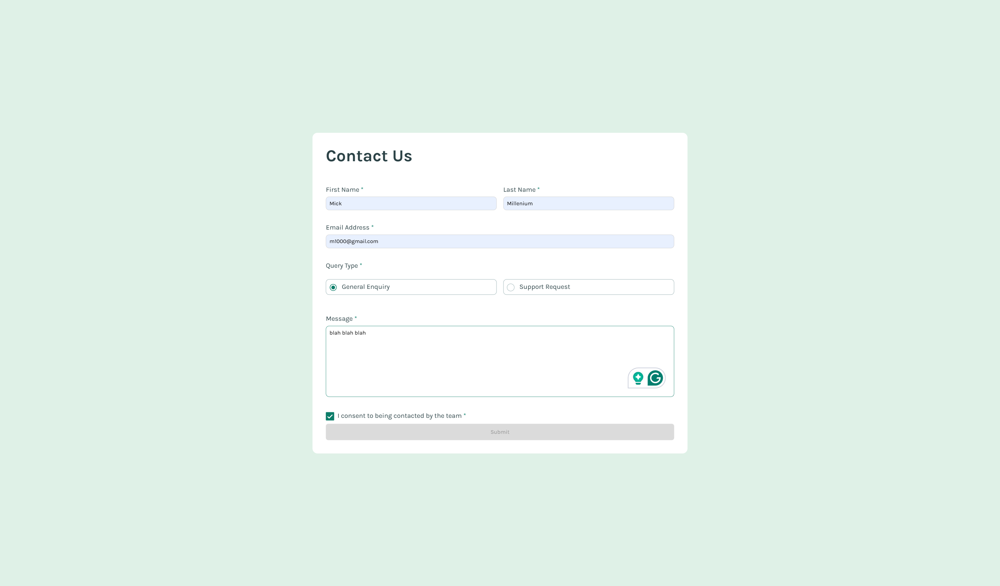
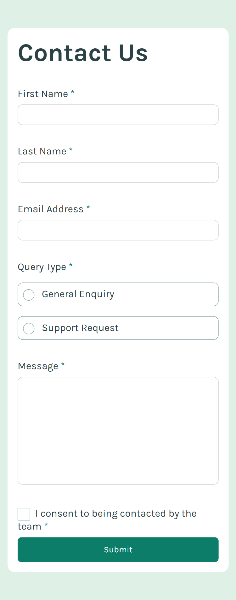

# Frontend Mentor - Contact form solution

This is a solution to the [Contact form challenge on Frontend Mentor](https://www.frontendmentor.io/challenges/contact-form--G-hYlqKJj). Frontend Mentor challenges help you improve your coding skills by building realistic projects.

## Table of contents

- [Overview](#overview)
  - [The challenge](#the-challenge)
  - [Screenshot](#screenshot)
  - [Links](#links)
  - [Built with](#built-with)
  - [What I learned](#what-i-learned)
  - [Continued development](#continued-development)
  - [Useful resources](#useful-resources)
- [Author](#author)

## Overview

This is an accessible contact form part of the FrontEnd Mentor challenge.

### The challenge

Users should be able to:

- Complete the form and see a success toast message upon successful submission
- Receive form validation messages if:
  - A required field has been missed
  - The email address is not formatted correctly
- Complete the form only using their keyboard
- Have inputs, error messages, and the success message announced on their screen reader
- View the optimal layout for the interface depending on their device's screen size
- See hover and focus states for all interactive elements on the page

### Screenshot

### Links

- Solution URL: [Add solution URL here](https://remainhumble.github.io/Accessible-Contact-Form/)
- Live Site URL: [Add live site URL here](https://github.com/remainhumble/Accessible-Contact-Form)

### Built with

- Semantic HTML5 markup
- CSS custom properties
- Flexbox
- Mobile-first workflow

### What I learned

- Built semantic, accessible markup: questions implemented as buttons inside list items with proper ARIA (aria-expanded) so screen readers and assistive tech behave correctly.
- Keyboard interactions: implemented Enter/Space to toggle, Arrow Up/Down to move focus, and Home/End for quick navigation — ensuring full keyboard-only control.

### Continued development

- Improve accessibility further
  - Add polite aria-live announcements for state changes and test with VoiceOver/NVDA.
  - Validate against WAI-ARIA Authoring Practices for accordions and run automated a11y audits.

- Testing and reliability
  - Add unit/integration tests for keyboard interactions (Jest + Testing Library).
  - Add end-to-end tests covering focus movement and edge cases (Playwright or Cypress).

- Focus management and keyboard UX
  - Extract reusable focus-management hooks/utilities (open/close, restore focus, trap when needed).
  - Ensure visible focus styles and support for prefers-reduced-motion.

- Componentization and documentation
  - Build a documented, themeable accordion component (Storybook stories, usage examples).
  - Publish clear API docs and examples for consumers.

- Performance and animation
  - Prefer CSS-driven animations, avoid layout thrashing; optimize for smooth transitions.
  - Respect reduced-motion preferences and test animation impact on low-end devices.

- Tooling and type safety
  - Adopt TypeScript for safer refactors.
  - Integrate linting, accessibility checks, and CI to catch regressions early.

- Cross-browser & responsive polish
  - Test interactive behavior across browsers and mobile keyboards; handle overflow/edge cases.
  - Improve visual polish and spacing for multiple breakpoints.

- Future accessibility enhancements
  - Consider announcing state changes with live regions, ARIA updates, and better screen-reader messaging.
  - Explore automated accessibility regression testing as part of CI.

### Useful resources

- [Building accessible forms](https://www.frontendmentor.io/learning-paths/introduction-to-web-accessibility-mXu-9PHVsd/article/6647781a20fb35b1b61abb54/read) - It's important to ensure your forms are accessible to all users, regardless of their abilities. In this article, it contains some best practices and techniques for building accessible forms.
- [Refactoring your code](https://www.frontendmentor.io/learning-paths/javascript-fundamentals-oR7g6-mTZ-/article/660eb6a32f40450f917475d8/read) - This is an amazing article which helped me structure and organise my codebase. Ideally, we expect our code to be comprehensive, and as readable and usable as possible.

## Author

- Frontend Mentor - [@remainhumble](https://www.frontendmentor.io/profile/remainhumble)
- X(formerly Twitter) - [@thiflan120699](https://x.com/thiflan120699)
